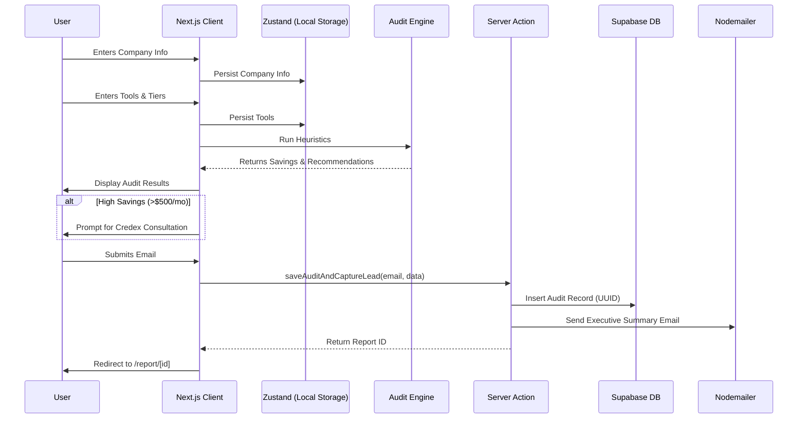

# Architecture & Data Flow

## System Diagram

## Why this Stack?
- **Next.js 15 (App Router):** Honestly it's just the industry standard at this point. Using Server Actions completely eliminated the need for me to stand up a separate Express backend.
- **Zustand:** Multi-step forms are a nightmare if you lose state. Zustand with the `persist` middleware automatically saves everything to `localStorage`. If a user accidentally hits refresh on step 3, they don't rage-quit.
- **shadcn/ui + Tailwind v4:** Allowed me to build a premium-looking UI in a few hours without writing custom CSS.
- **Supabase:** I just needed a fast Postgres database to dump the leads into. Supabase handles the boilerplate.

## Scaling to 10k audits/day
If this tool somehow went viral and hit 10k audits/day, the architecture would actually hold up fine because the heavy lifting (the audit engine math) runs entirely client-side.
But I'd definitely need to fix a few things:
1. **Rate Limiting:** My current Server Action just uses a dumb in-memory `Map` to rate limit by IP. At scale across distributed serverless functions, that's useless. I'd swap it for Upstash Redis.
2. **Database Connection:** I'd have to turn on Supabase's connection pooler (Supavisor) so we don't instantly exhaust Postgres connections during a traffic spike.
3. **Queueing Emails:** Firing Nodemailer synchronously inside the Server Action is risky if the SMTP server lags. I'd push the email task to an asynchronous background queue like Inngest.
