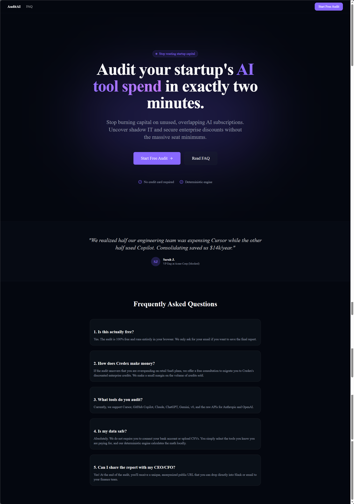
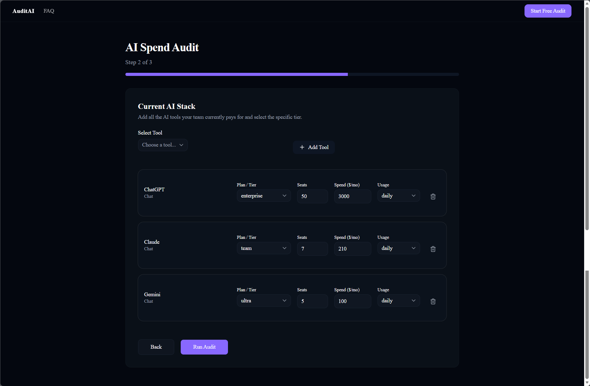
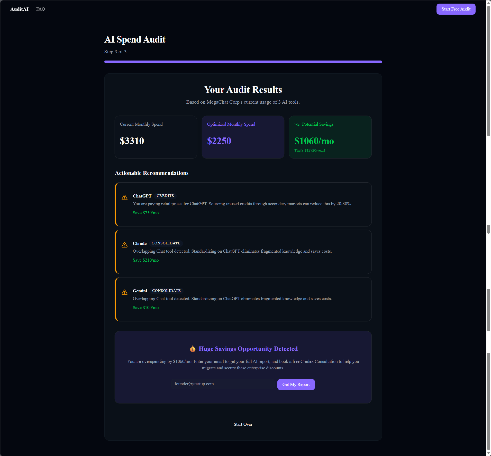
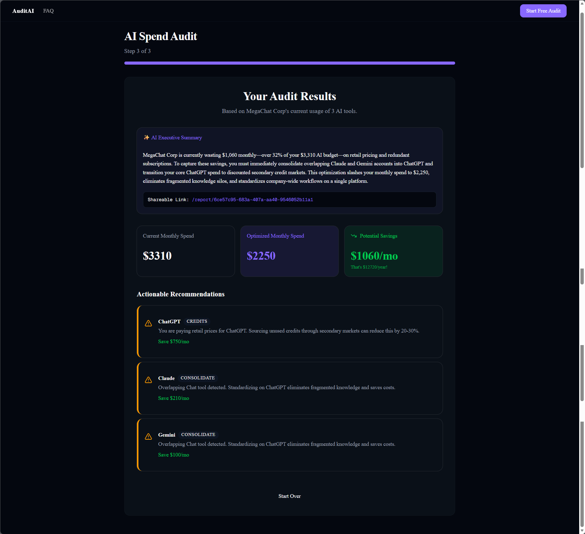

# AuditAI: The "Mint for AI Tool Spend"

AuditAI is a free web app that helps startup founders and engineering managers instantly audit their SaaS AI tool stack (ChatGPT, Cursor, Copilot, Claude, etc.) to uncover thousands of dollars in wasted capital from overprovisioning, overlapping tools, and retail pricing. It serves as a high-value lead generation tool for Credex.

## Preview
*(Please see the screenshots demonstrating the UI flow linked below)*





## Quick Start

1. **Install dependencies:**
```bash
npm install
```

2. **Run locally:**
```bash
npm run dev
```

3. **Deploy:**
This project is optimized for Vercel. 
```bash
npx vercel deploy
```
Make sure to add your `NEXT_PUBLIC_SUPABASE_URL`, `NEXT_PUBLIC_SUPABASE_ANON_KEY`, and `RESEND_API_KEY` to the Vercel environment variables.

## Deployed URL
The live version of this project is deployed at: https://project1-gamma-lovat.vercel.app/
## Decisions (Trade-offs)
1. **Rule-based Engine vs AI Math:** I chose to hardcode the financial logic rather than passing the usage to an LLM. AI is non-deterministic, and a financial audit must be defensible and mathematically rigorous.
2. **Zustand vs URL Params:** I used Zustand with localStorage for state persistence. Storing complex arrays of tools in URL params (nuqs) would create massive, ugly URLs and hit string length limits.
3. **Server Actions vs API Routes:** I opted for Server Actions to handle the lead capture and Resend email logic. This reduces boilerplate and keeps backend logic closely coupled with the frontend form.
4. **Mocked AI Fallback:** I built a structured logic fallback for the "AI Executive Summary". This ensures the MVP can be run locally by anyone without requiring them to set up an OpenAI/Anthropic API key first.
5. **In-Memory Rate Limiting:** I used an in-memory Map for rate limiting the lead capture. While Redis (Upstash) is better for production, an in-memory map keeps the MVP completely free of external dependencies for local testing while still providing basic honeypot/abuse protection.
